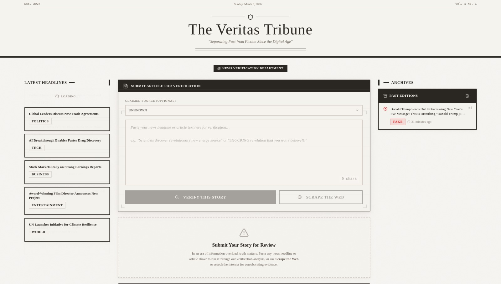
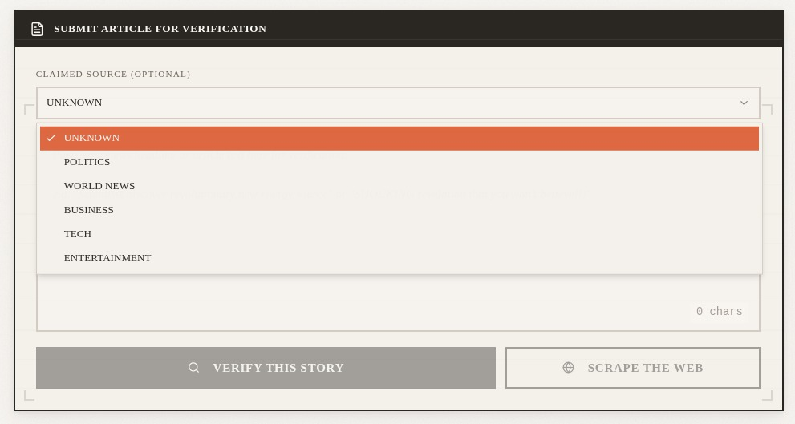
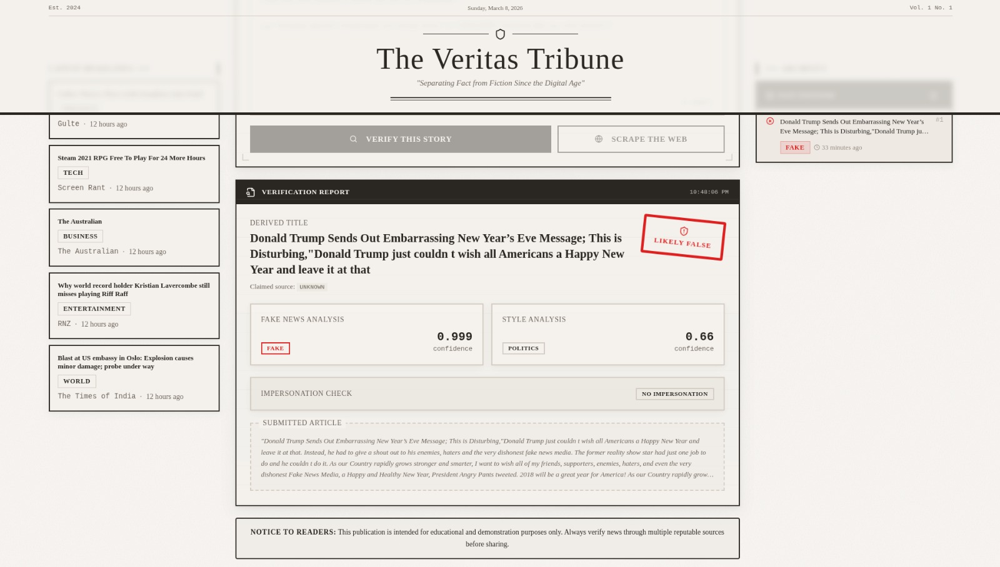
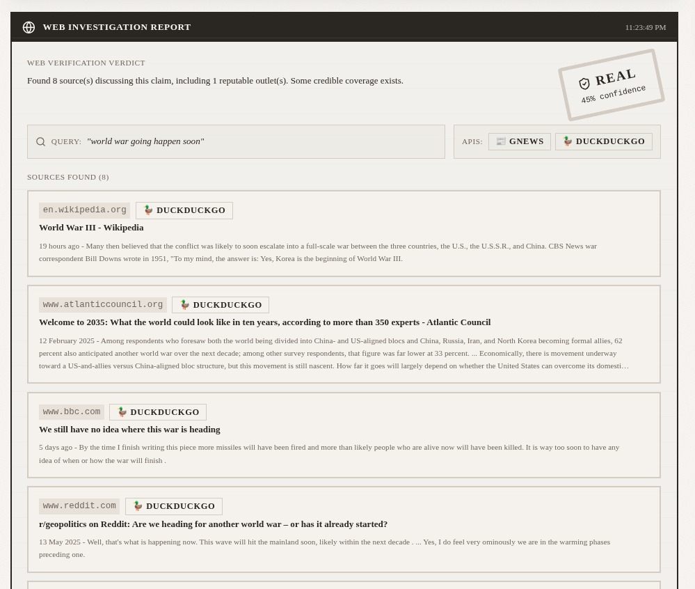

<div align="center">

# The Veritas Tribune

### *"Separating Fact from Fiction Since the Digital Age"*

<br>


<br>

A vintage newspaper-themed fake news detection platform powered by **Machine Learning** and **Multi-API Web Scraping**.
Paste any news article, get a verdict in seconds.

<br>

[Features](#features) · [Screenshots](#screenshots) · [Architecture](#architecture) · [Getting Started](#getting-started) · [Usage](#usage)

</div>

<br>

---

<br>

## Screenshots

<div align="center">

### Homepage — The Newsroom



<br><br>

### Source Category Selector



<br><br>

### ML Verification Report



<br><br>

### Web Investigation Report



</div>

<br>

---

<br>

## Features

| | Feature | Description |
|---|---------|-------------|
| **ML Verification** | Verify This Story | Analyzes articles using trained ML models for fake news detection, source attribution, and impersonation checking |
| **Web Scraping** | Scrape the Web | Cross-references claims across GNews, Google Fact Check, and DuckDuckGo APIs |
| **Verdicts** | Confidence Scoring | Delivers REAL / FAKE / UNVERIFIED verdicts with confidence percentages and detailed explanations |
| **Live Headlines** | News Ticker | Fetches real-time headlines across Politics, Tech, Business, Entertainment, and World categories |
| **History** | Archives Panel | Stores past verifications in local storage for quick reference |
| **Design** | Newspaper Aesthetic | Vintage editorial UI with blackletter mastheads, stamp-style verdicts, and parchment tones |
| **Responsive** | Any Device | Full responsive layout that adapts from desktop to mobile |

<br>

---

<br>

## Architecture

> **This project is split across two repositories:**

| | Repository | Stack | Description |
|---|------------|-------|-------------|
| **Frontend** | [**FalseFind**](https://github.com/sanjayrohith/FalseFind) | React, TypeScript, Vite, Tailwind CSS | The newspaper-themed UI — this repo |
| **Backend** | [**source-attribution**](https://github.com/sanjayrohith/source-attribution) | Python, FastAPI, ML Models | API server handling ML inference and web scraping |

The frontend communicates with the backend via REST API at `http://localhost:8000`.

```
┌─────────────────────────────────────────────────────────┐
│                    The Veritas Tribune                   │
│                  (React / TypeScript)                    │
│                                                         │
│  ┌──────────┐  ┌──────────────┐  ┌───────────────────┐  │
│  │ Headlines │  │ Article Input │  │ History Archives  │  │
│  │  Sidebar  │  │  + Verdicts   │  │    Sidebar        │  │
│  └────┬─────┘  └──────┬───────┘  └───────────────────┘  │
│       │               │                                  │
└───────┼───────────────┼──────────────────────────────────┘
        │               │
        ▼               ▼
┌─────────────────────────────────────────────────────────┐
│              source-attribution Backend                  │
│                 (FastAPI / Python)                       │
│                                                         │
│  /headlines    /analyze           /scrape-verify         │
│  ┌─────────┐  ┌────────────────┐  ┌──────────────────┐  │
│  │  GNews  │  │  ML Models     │  │  GNews API       │  │
│  │   API   │  │  (Detection +  │  │  Google Fact     │  │
│  │         │  │   Attribution) │  │  DuckDuckGo      │  │
│  └─────────┘  └────────────────┘  └──────────────────┘  │
└─────────────────────────────────────────────────────────┘
```

<br>

---

<br>

## Getting Started

### Prerequisites

- **Node.js 18+** (or Bun)
- **Python 3.10+** (for the backend)

### 1. Clone Both Repos

```bash
# Frontend
git clone https://github.com/sanjayrohith/FalseFind.git

# Backend
git clone https://github.com/sanjayrohith/source-attribution.git
```

### 2. Start the Backend

```bash
cd source-attribution
source venv/bin/activate
python -m uvicorn app.main:app --reload
# Backend runs at http://localhost:8000
```

### 3. Start the Frontend

```bash
cd FalseFind
npm install
npm run dev
# Frontend runs at http://localhost:8080
```

<br>

---

<br>

## Usage

### Verify This Story (ML Analysis)

1. Paste a news headline or full article into the text area
2. Optionally select a claimed source category (Politics, World News, Business, Tech, Entertainment)
3. Click **"Verify This Story"**
4. Review the **Verification Report** — verdict stamp, fake news confidence, style analysis, and impersonation check

### Scrape the Web (Multi-API Verification)

1. Paste any news claim into the text area
2. Click **"Scrape the Web"**
3. Review the **Web Investigation Report** — verdict with confidence %, explanation, fact-checks, and all discovered sources with provider badges

### Live Headlines

The left sidebar displays real-time headlines from GNews across five categories. Headlines refresh on every page load.

### History Archive

The right sidebar keeps a log of your past verifications. Click any entry to reload its results.

<br>

---

<br>

## Tech Stack

| Layer | Technology | Purpose |
|-------|------------|---------|
| **Framework** | React 18 | Component-based UI |
| **Language** | TypeScript 5.8 | Type safety |
| **Build** | Vite 5.4 (SWC) | Fast dev server and bundling |
| **Styling** | Tailwind CSS 3.4 | Utility-first CSS |
| **Components** | shadcn/ui (Radix) | Accessible base components |
| **Icons** | Lucide React | Clean iconography |
| **Dates** | date-fns | Relative time formatting |
| **Testing** | Vitest + fast-check | Unit and property-based tests |

### Design System

| Element | Font / Style |
|---------|-------------|
| Masthead | UnifrakturMaguntia (blackletter) |
| Headlines | Playfair Display (editorial serif) |
| Body text | Source Serif 4 (readable serif) |
| Colors | Warm parchment tones via HSL CSS variables |
| Verdicts | Stamp-style animated badges |

<br>

---

<br>

## Scripts

| Command | Description |
|---------|-------------|
| `npm run dev` | Start development server |
| `npm run build` | Production build |
| `npm run preview` | Preview production build |
| `npm run lint` | Run ESLint |
| `npm run test` | Run tests |

<br>

---

<br>

## Disclaimer

This tool is for **educational and demonstration purposes only**. It uses ML heuristics and web search results — it is not a definitive fact-checking authority. Always verify news through multiple reputable sources before sharing.

## License

MIT

<br>

---

<div align="center">

**The Veritas Tribune** — *Fighting Misinformation, One Story at a Time*

[Frontend Repo](https://github.com/sanjayrohith/FalseFind) · [Backend Repo](https://github.com/sanjayrohith/source-attribution)

</div>
